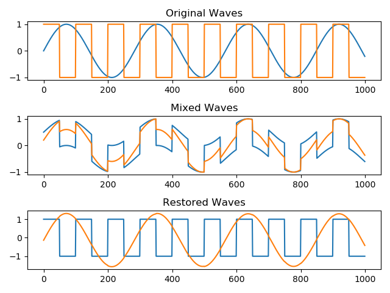

# FastICA (Independent Component Analysis) in Python

## What is ICA?
>Independent component analysis (ICA) is a computational method for separating a multivariate signal into additive subcomponents.
>(https://en.wikipedia.org/wiki/Independent_component_analysis)

## Algorithm
1. Center x
2. Whiten x

where
**E** is an orthogonal matrix of eigenvectors.
**D** is a diagonalamtrix of eigenvalues.
3. Choose an initial value of **w** randomly
where

4. Compute new **w**

where

5. Normalize new **w**

6. While **w** has not converged, return to 4. Check the convergence by computing

7. Compute the dot product of **w** and **x** and you get **S**

## Example

